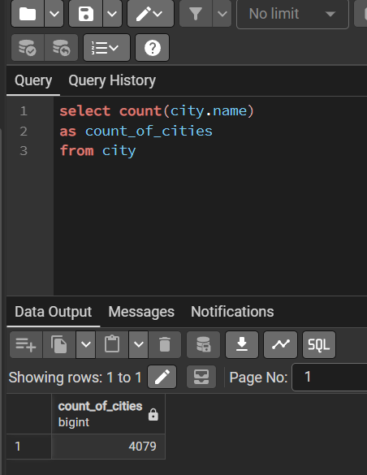
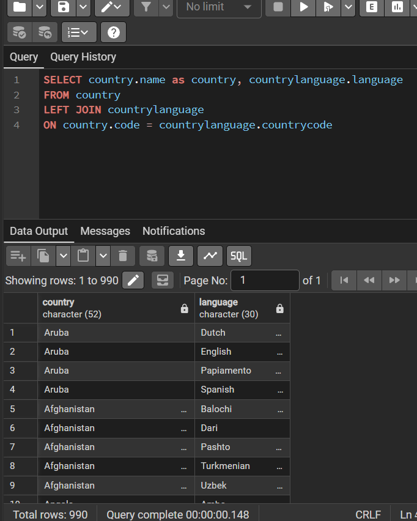
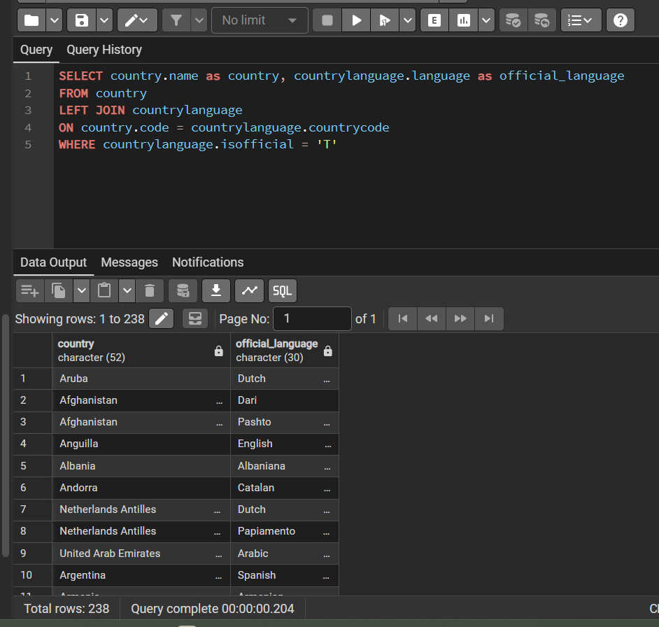
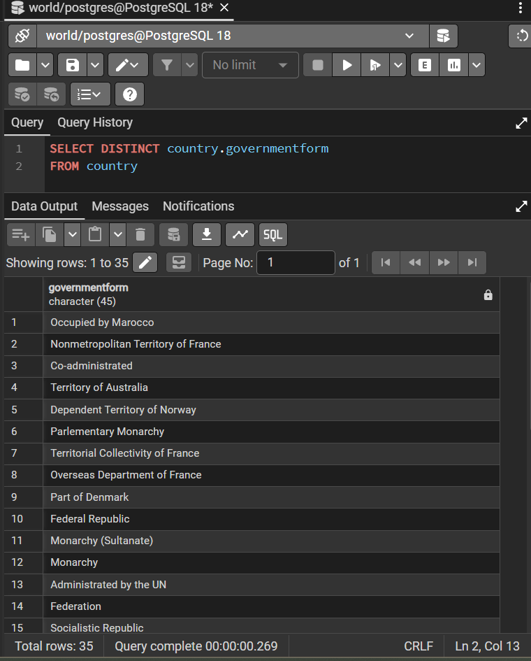
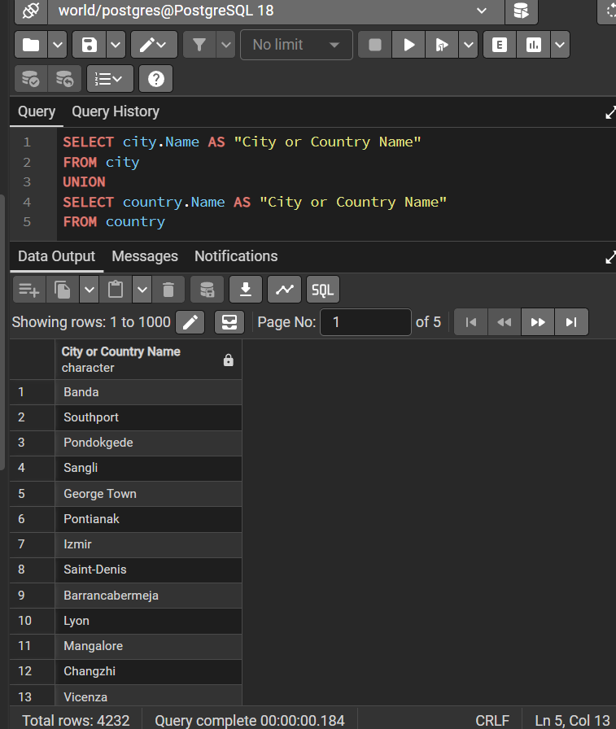
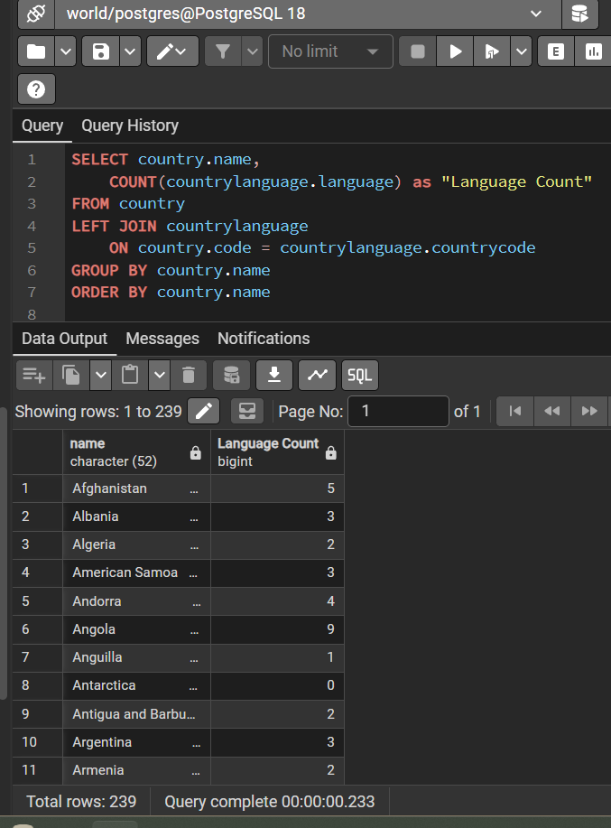
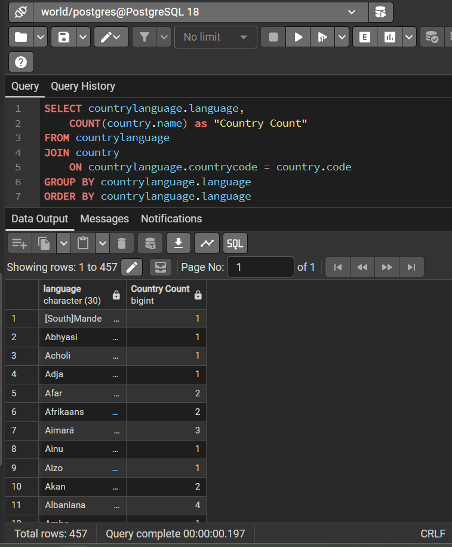
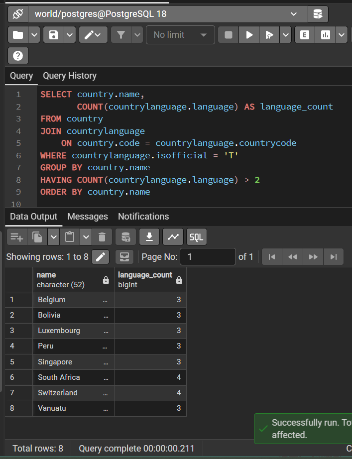
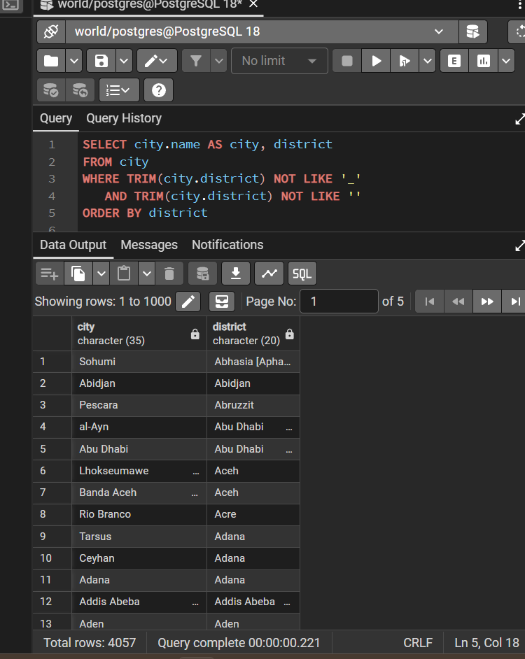
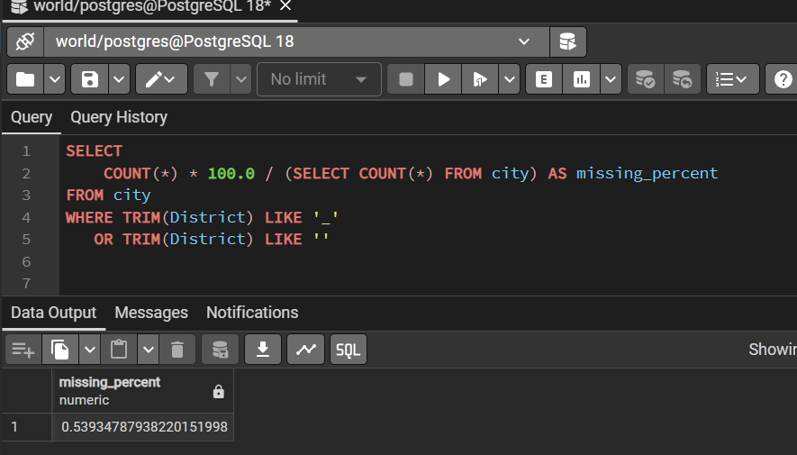

# Exercise 02: World Database – Joins, Grouping, and Data Quality

- Name: Kami Denny
- Course: Database for Analytics
- Module: 2
- Database Used: World Database (PostgreSQL)

---

## Instructions

- Answer each question below using SQL executed against the **World database**.
- All SQL commands **must be run by you**.
- For each SQL-based question:
  - Include the SQL command in a fenced code block
  - Include a **screenshot** showing the command and its results
- Store screenshots in the `screenshots/` folder and embed them below each answer.

---

## Question 1

When importing records from `worldPGSQL.sql`, **how many cities were imported**?

### Answer

4079

### Screenshot

_Show evidence of how you determined this (for example, a COUNT query)._

```sql
select count(city.name)
as count_of_cities
from city
```



---

## Question 2

Using the World database, write the SQL command to
**display each country name**
along with the **name of each language spoken in that country**.

### SQL

```sql
SELECT country.name as country, countrylanguage.language
FROM country
JOIN countrylanguage
ON country.code = countrylanguage.countrycode
```

### Screenshot



---

## Question 3

Using the World database, write the SQL command
to **display each country name** along with the name
of each **official language spoken in that country**.

### SQL

```sql
SELECT country.name as country, countrylanguage.language as official_language
FROM country
LEFT JOIN countrylanguage
ON country.code = countrylanguage.countrycode
WHERE countrylanguage.isofficial = 'T'
```

### Screenshot



---

## Question 4

Consider the following two SQL statements:

```sql
SELECT *
FROM country, countrylanguage
WHERE country.code = countrylanguage.countrycode;
```

```sql
SELECT *
FROM country
LEFT OUTER JOIN countrylanguage
ON country.code = countrylanguage.countrycode;
```

**In your own words**, describe what data the
**second query returns that the first query does not**.

### Answer

The first query is an INNER JOIN, so it only returns countries that have at least one matching language in the countrylanguage table, totaling 984 rows. The second query uses a LEFT OUTER JOIN, which returns all countries including those with no language records. That’s why it returns 990 rows. The extra 6 rows represent countries that have no matching language, and their language fields appear as NULL. The second query keeps every row from the left table even when no match exists.

---

## Question 5

Using the World database, write the SQL command
to **list all different forms of government** found in the data.
Do **not** repeat any form of government more than once.

### SQL

```sql
SELECT DISTINCT country.governmentform
FROM country
```

### Screenshot



---

## Question 6

Using the World database, write the SQL command
to **list all names of cities and countries in one column**.
Label the column **"City or Country Name"**.

### SQL

```sql
SELECT city.Name AS "City or Country Name"
FROM city
UNION
SELECT country.Name AS "City or Country Name"
FROM country
```

### Screenshot



---

## Question 7

Using the World database, write the SQL command
to **list all countries by name**,
along with the **number of languages spoken in each country**.
Be sure to **sort by country name**.

### SQL

```sql
SELECT country.name,
	COUNT(countrylanguage.language) as "Language Count"
FROM country
LEFT JOIN countrylanguage
	ON country.code = countrylanguage.countrycode
GROUP BY country.name
ORDER BY country.name
```

### Screenshot



---

## Question 8

Using the World database, write the SQL command
to **list all languages**, along with the
**number of countries where each language is spoken**.
Be sure to **sort by language name**.

### SQL

```sql
SELECT countrylanguage.language,
	COUNT(country.name) as "Country Count"
FROM countrylanguage
JOIN country
	ON countrylanguage.countrycode = country.code
GROUP BY countrylanguage.language
ORDER BY countrylanguage.language
```

### Screenshot



---

## Question 9

Using the World database, write the SQL command
to **list countries that have more than two official languages**,
along with the **number of official languages spoken**.

_Hint: There are 8 such countries in this dataset._

### SQL

```sql
SELECT country.name,
    COUNT(countrylanguage.language) as language_count
FROM country
JOIN countrylanguage
    ON country.code = countrylanguage.countrycode
WHERE countrylanguage.isofficial = 'T'
GROUP BY country.name
HAVING COUNT(countrylanguage.language) > 2
ORDER BY country.name
```

### Screenshot



---

## Question 10

Using the World database, write the SQL command to
**find cities where the district value is missing**.

Hint: Use `LIKE` and the dash (`-`)
since some rows use that instead of actual data.

### SQL

```sql
SELECT city.name AS city, district
FROM city
WHERE TRIM(city.district) NOT LIKE '_'
   AND TRIM(city.district) NOT LIKE ''
ORDER BY district
```

### Screenshot



---

## Question 11

Using the World database, write the SQL command to
**calculate the percentage of cities with missing district values**.

_Hint: The result should be approximately 0.4%._

### SQL

```sql
SELECT
    COUNT(*) * 100.0 / (SELECT COUNT(*) FROM city) AS missing_percent
FROM city
WHERE TRIM(District) LIKE '_'
   OR TRIM(District) LIKE ''
```

### Screenshot


