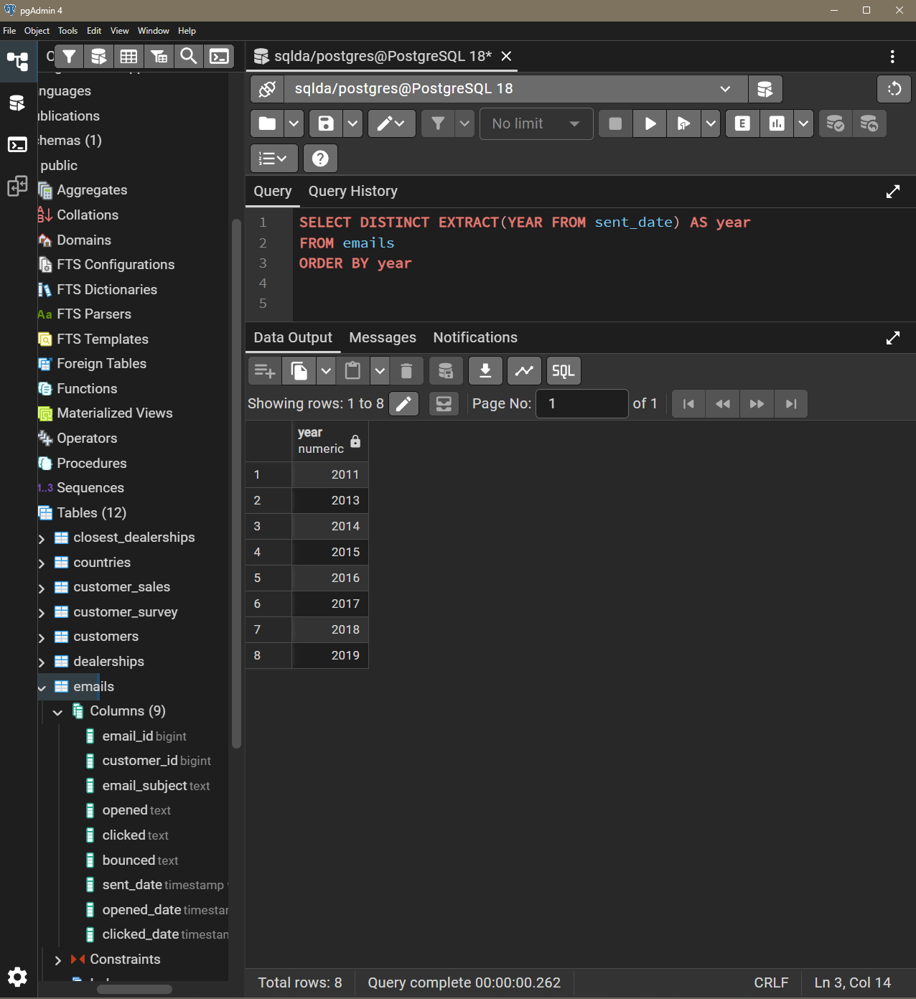
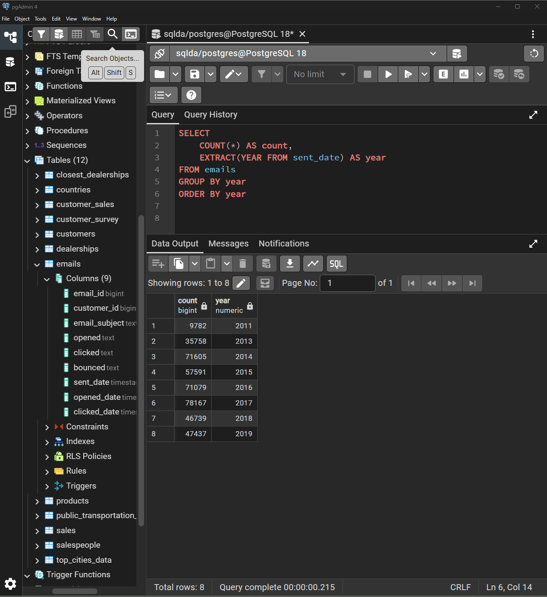
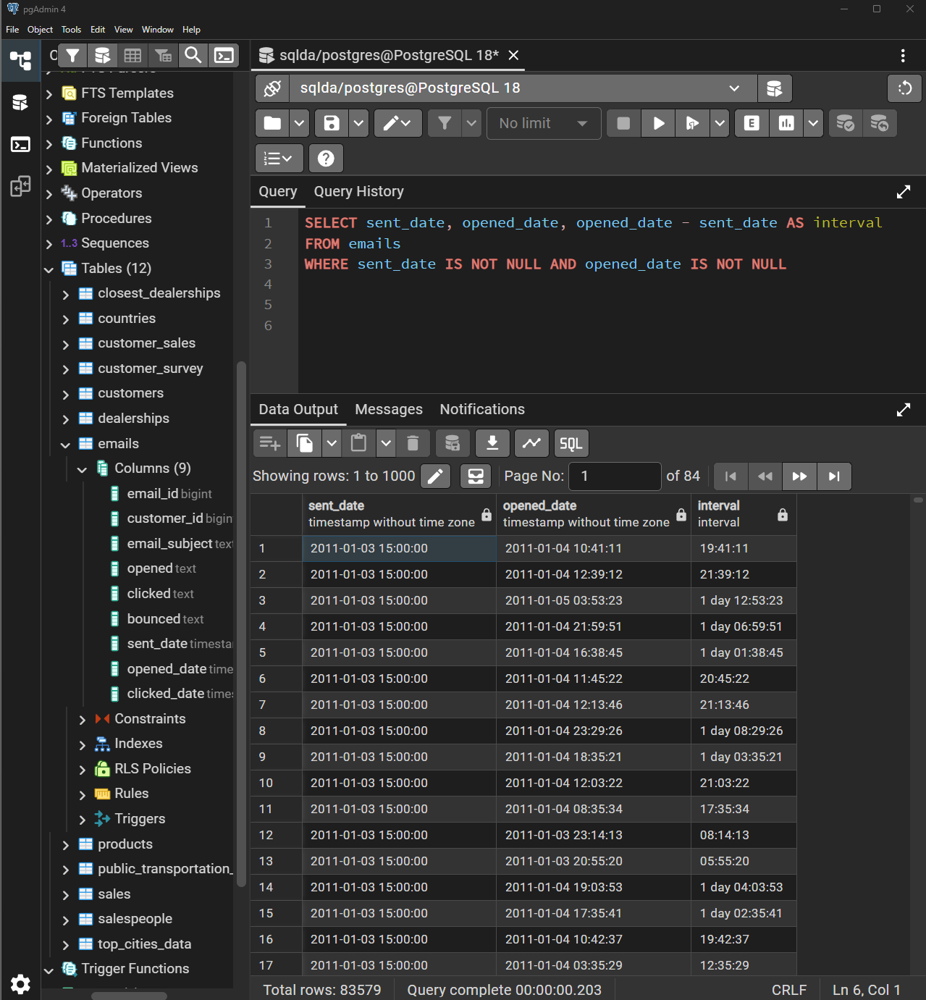
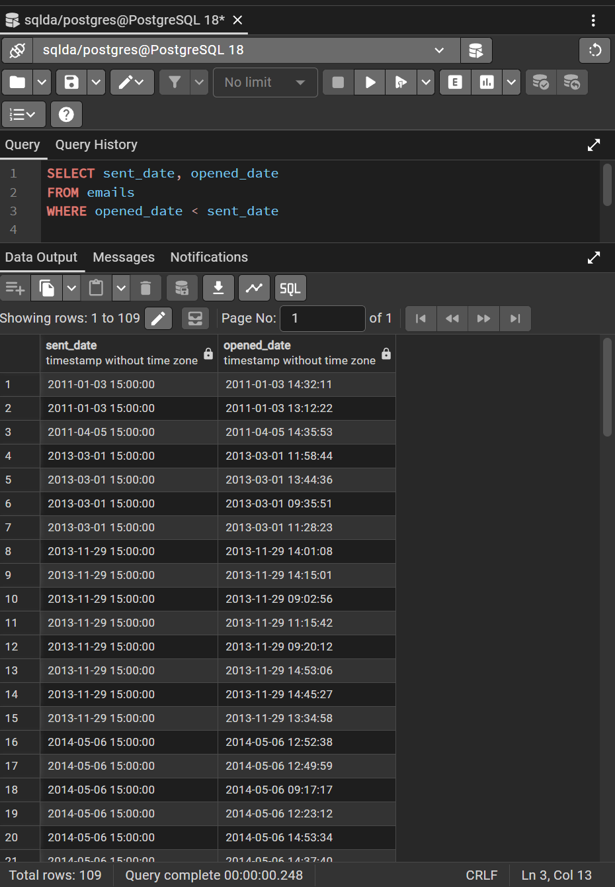
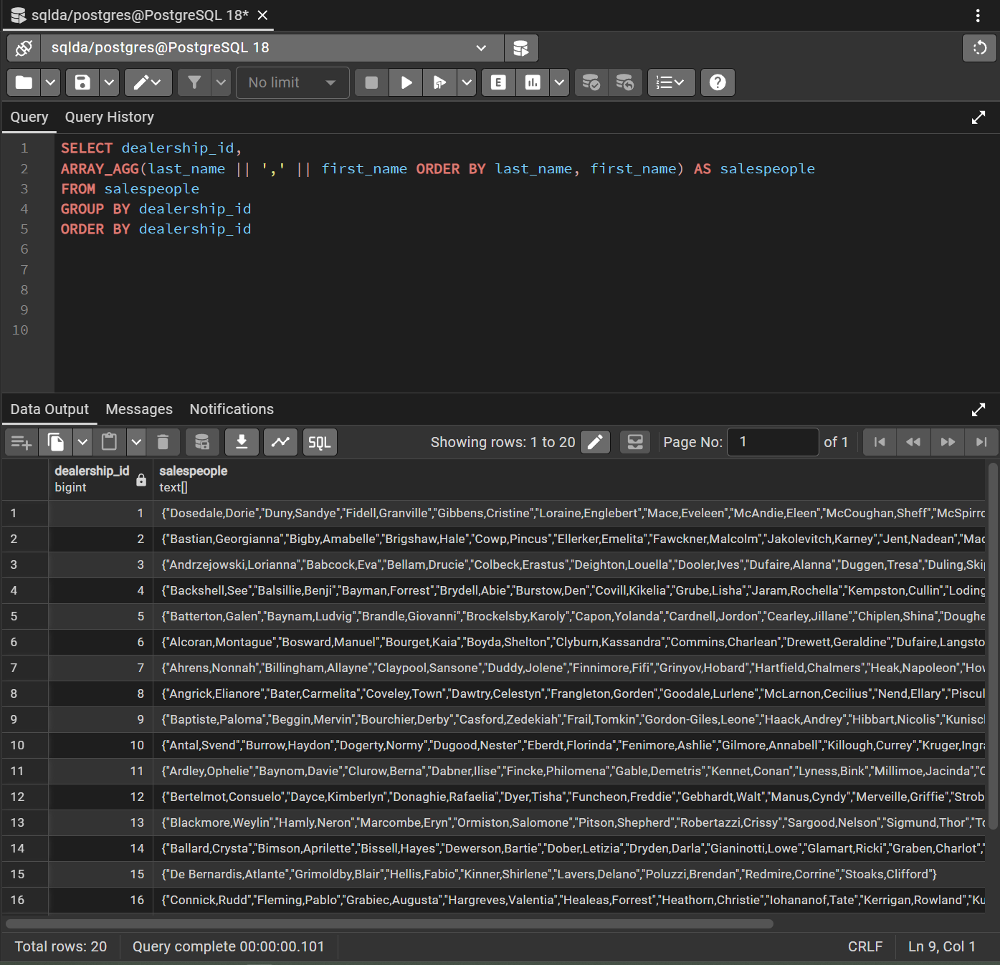
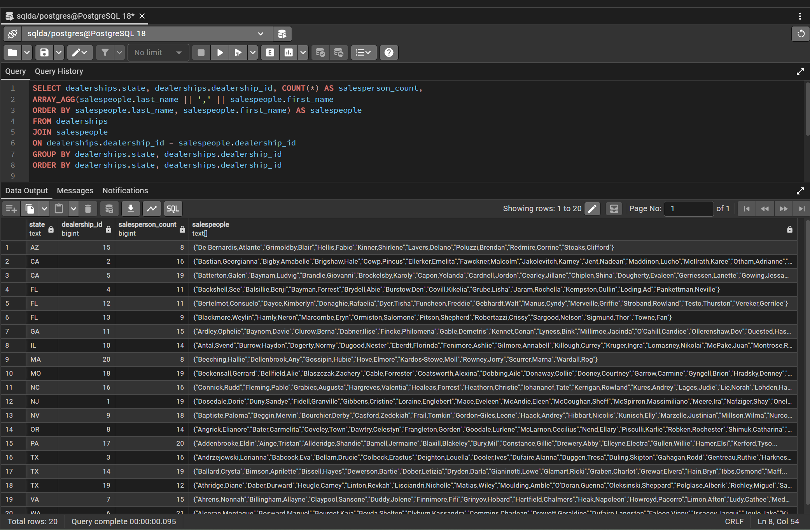
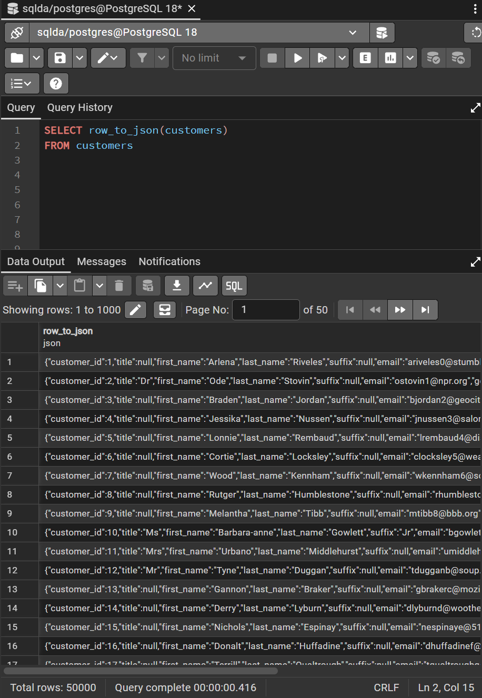
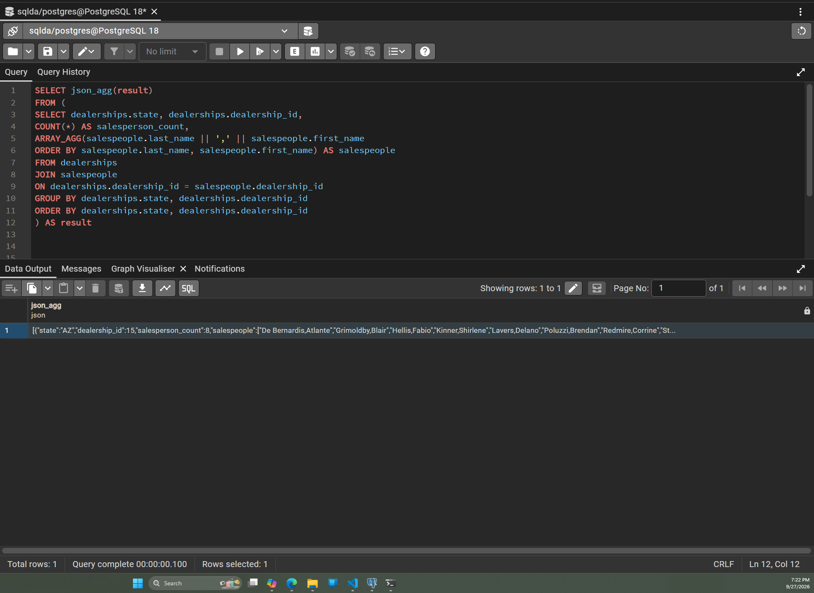
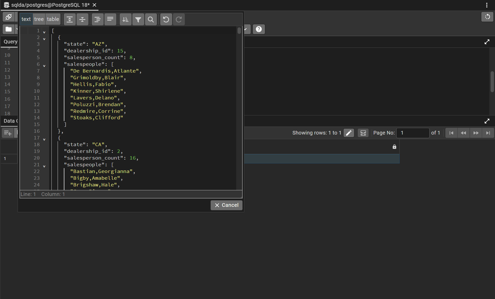

# Exercise 05: SQLDA Database - Dates, Data Quality, Arrays, and JSON

- Name: Kami Denny
- Course: Database for Analytics
- Module: 5
- Database Used: `sqlda` (Sample Datasets)
- Tools Used: PostgreSQL (pgAdmin)

---

## Instructions

- Use the **sqlda** database from the "Loading the Sample Datasets" instructions.
- For each SQL task:
  - Include your SQL in a fenced code block
  - Execute it and include a **screenshot** showing the query and results
- Store screenshots in the `screenshots/` folder and embed them below each answer.
- For explanation questions:
  - Write your answer in complete sentences
  - Include a screenshot if requested

---

## Question 1

Using the `sqlda` database, write the SQL needed
to show a **list of years** that emails were sent.

Your results should list years like this (order matters):

```text
year
2011
2013
2014
2015
2016
2017
2018
2019
```

### SQL

```sql
SELECT DISTINCT EXTRACT(YEAR FROM sent_date) AS year
FROM emails
ORDER BY year
```

### Screenshot



---

## Question 2

Using the `sqlda` database, write the SQL needed to
show the **number of messages sent by year**,
ordered by year (as shown in the prompt).

Output should resemble:

```text
count   year
...
```

### SQL

```sql
SELECT
    COUNT(*) AS count,
    EXTRACT(YEAR FROM sent_date) AS year
FROM emails
GROUP BY year
ORDER BY year
```

### Screenshot



---

## Question 3

Using the `sqlda` database, write the SQL needed to show:

- the **sent date**
- the **opened date**
- the **interval** between the two

Only include emails that contain **both** a sent date and an opened date.

### SQL

```sql
SELECT sent_date, opened_date, opened_date - sent_date AS interval
FROM emails
WHERE sent_date IS NOT NULL AND opened_date IS NOT NULL
```

### Screenshot



---

## Question 4

Using the `sqlda` database,
write the SQL needed to
show emails that contain an **opened date BEFORE the sent date**.

### SQL

```sql
SELECT sent_date, opened_date
FROM emails
WHERE opened_date < sent_date
```

### Screenshot



---

## Question 5

Using the `sqlda` database:
there are **over 100 emails**
that contain an opened date **BEFORE** the sent date.

After looking at the data, **why is this the case?**

### Answer

After examining the data, I noticed that all 109 problematic records have a sent_date timestamp of exactly 15:00:00. It’s unlikely that this many emails were truly sent at the same exact time. This indicates that the sent_date values were added later using a default time during data import or cleanup. Because the opened_date values reflect the actual time the emails were opened, many of them appear to occur before the artificially assigned sent_date, creating the incorrect ordering.

### Screenshot (if requested by instructor)


---

## Question 6

Using the `sqlda` database, explain in your own words what the following code does:

```sql
CREATE TEMP TABLE customer_points AS (
    SELECT
        customer_id,
        point(longitude, latitude) AS lng_lat_point
    FROM customers
    WHERE longitude IS NOT NULL
    AND latitude IS NOT NULL
);

CREATE TEMP TABLE dealership_points AS (
    SELECT
        dealership_id,
        point(longitude, latitude) AS lng_lat_point
    FROM dealerships
);

CREATE TEMP TABLE customer_dealership_distance AS (
    SELECT
       customer_id,
       dealership_id,
       c.lng_lat_point <@> d.lng_lat_point AS distance
    FROM customer_points c
    CROSS JOIN dealership_points d
);
```

### Answer

A temporary table named customer_points is created and filled with each customer’s ID along with a geographic point built from their latitude and longitude. A second temporary table, dealership_points, stores the same type of point data for each dealership along with its ID. The final temporary table combines both sets of points and calculates the straight‑line distance between every customer and every dealership, producing a table of customer IDs, dealership IDs, and the distance between them.

---

## Question 7

Using the `sqlda` database,
write SQL to display an
**array of salespeople for each dealership**,
sorted by dealership.

For example - dealership 1 is below:

```text
"{""Fidell,Granville"",""Onele,Jereme"",""Sheriff,Lelia"",""McSpirron,Massimiliano"",""Rennick,Nadia"",""Mace,Eveleen"",""Oxteby,Dukie"",""Spong,Marcos"",""Wogden,Quent"",""Duny,Sandye"",""Loraine,Englebert"",""Meere,Ira"",""Gibbens,Cristine"",""Prine,Lyda"",""McCoughan,Sheff"",""Schule,Giselbert"",""McAndie,Eleen"",""Dosedale,Dorie"",""Nafziger,Shay""}"
```

### SQL

```sql
SELECT dealership_id,
ARRAY_AGG(last_name || ',' || first_name ORDER BY last_name, first_name) AS salespeople
FROM salespeople
GROUP BY dealership_id
ORDER BY dealership_id
```

### Screenshot



---

## Question 8

Using the `sqlda` database, write SQL to display:

- an **array of salespeople for each dealership**
- the **state** of the dealership
- the **number of salespeople** for the dealership

Sort by **state**.

Reference image:


### SQL

```sql
SELECT dealerships.state, dealerships.dealership_id, COUNT(*) AS salesperson_count,
ARRAY_AGG(salespeople.last_name || ',' || salespeople.first_name
ORDER BY salespeople.last_name, salespeople.first_name) AS salespeople
FROM dealerships
JOIN salespeople
ON dealerships.dealership_id = salespeople.dealership_id
GROUP BY dealerships.state, dealerships.dealership_id
ORDER BY dealerships.state, dealerships.dealership_id
```

### Screenshot



---

## Question 9

Using the `sqlda` database, write the SQL needed to convert
the **customers** table to **JSON**.

### SQL

```sql
SELECT row_to_json(customers)
FROM customers
```

### Screenshot



---

## Question 10

Using the `sqlda` database, write SQL to display:

- an **array of salespeople for each dealership**
- the **state**
- the **number of salespeople**
- sorted by **state**

Then **convert this result to JSON**.

Reference image:


### SQL

```sql
SELECT json_agg(result)
FROM (
SELECT dealerships.state, dealerships.dealership_id,
COUNT(*) AS salesperson_count,
ARRAY_AGG(salespeople.last_name || ',' || salespeople.first_name
ORDER BY salespeople.last_name, salespeople.first_name) AS salespeople
FROM dealerships
JOIN salespeople
ON dealerships.dealership_id = salespeople.dealership_id
GROUP BY dealerships.state, dealerships.dealership_id
ORDER BY dealerships.state, dealerships.dealership_id
) AS result
```

### Screenshot



